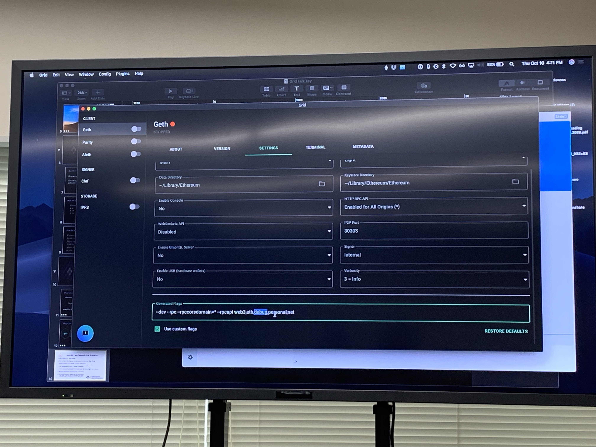

# Devcon5 第三天趣談

## Fuzzing the Solidity Compiler

講者： Bhargava Shastry

**Solidity error patterns 的挑戰**

## Delightful Developer Experience With Solidity Hot Loader

- 講者：Igor Yalovoy
- [solidity-loader](https://github.com/OpenZeppelin/solidity-loader) : Solidity Hot Loader for Starter Kits

## How to Make Ethereum Really Trustless?

講者：Alexander Praetorius, Nina Breznik

這是一場是以 Open discussion 的方式進行，講者事前邀請了各模組的作者坐在台下，進行各種議題的討論。

## Remix New Features & Plugin Governance

講者：Rob Stupay, Yann Levreau, Liana Husikyan, Iuri Matias, François Guezengar

這場就像 Remix 的新功能發表會，主要 Demo 支援 Plugin 的部分。

這三位是目前 Remix Team 的主要成員，最左邊是 Yann，中間是 François。

Christian Reitwiessner 是 Solidity 語言的作者被邀請來請 contract 驗證的部分。

### Gird UI

因為現在相關的工具和 Client 端有太多種類了，Grid UI 是一個桌機版的應用程式，讓你可以快速切換各種環境。

- <https://github.com/ethereum/grid-ui>
- <https://grid.ethereum.org/>

<!--  -->

### zokrates

這是一位是 ZoKrates plugin 的作者，被邀請來講開發 plugin 的成功案例。

- [ZoKrates - zkSNARKs On Ethereum (made easy)](https://www.hackernoon.com/zokrates-zksnarks-on-ethereum-made-easy-ql5oc3638)

